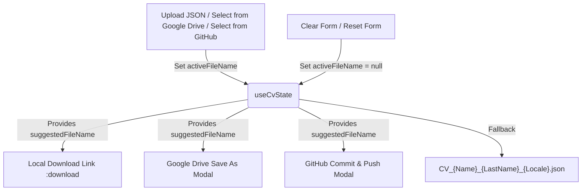

# Shared Filename Suggestion Design Specification

**Date**: 2026-08-06  
**Topic**: Shared Filename Suggestion Across Storage and Download Targets

---

## 1. Goal & Context

When a user loads or uploads a CV JSON file from any source (Local File Upload, Google Drive, or GitHub Storage), the original filename (e.g. `My_Resume.json`) should be preserved and suggested across all other export and save targets (Local JSON Download, Google Drive Save As, GitHub Commit & Push). If the form is explicitly cleared or reset, the suggested filename reverts to the default dynamic format (`CV_${FirstName}_${LastName}_${Locale}.json`).

---

## 2. Technical Architecture & Component Changes

### 2.1 Central State Management (`data/useCvState.ts`)

- **State Addition**:
  - Add `activeFileName: string | null` to `state` in `useCvState.ts`.
  - Persist `activeFileName` in `localStorage` under `cv_active_file_name`.

- **Actions & Helpers**:
  - `setActiveFileName(fileName: string | null)`: Updates `state.activeFileName` and syncs to `localStorage`.
  - `uploadCV(e: Event)`: Reads `e.target.files[0].name`, parses JSON content, updates form settings, and calls `setActiveFileName(file.name)`.
  - `resetForm()` & `clearForm()`: Reset `state.activeFileName = null` and remove `cv_active_file_name` from `localStorage`.
  - `setUpCvSettings()`: Restores `activeFileName` from `localStorage` on initial page load if present.

- **Computed `suggestedFileName`**:
  ```ts
  const suggestedFileName = computed(() => {
    if (state.activeFileName?.trim()) {
      const baseName = state.activeFileName.trim().split('/').pop() || state.activeFileName.trim()
      return baseName.endsWith('.json') ? baseName : `${baseName}.json`
    }
    const name = state.formSettings.name?.trim() || 'Untitled'
    const lastName = state.formSettings.lastName?.trim() || 'CV'
    const locale = i18n.locale?.value || 'en'
    return `CV_${name}_${lastName}_${locale}.json`
  })
  ```

---

### 2.2 Local Download (`components/CvSettings.vue`)

- Update the **Download CV settings (JSON)** action link:
  - Bind `:download="suggestedFileName"` instead of hardcoded string formatting.

---

### 2.3 Google Drive Integration (`composables/useGoogleDrive.ts` & `components/CvGoogleDriveSync.vue`)

- **`useGoogleDrive.ts`**:
  - When a file is loaded (`loadFileFromDrive`): Call `setActiveFileName(fileName)`.
  - When saving as a new file (`saveToDrive` with `asNewFile = true`): Call `setActiveFileName(customFileName)`.
  - When resetting active drive file (`resetActiveDriveFile`): If active storage was Drive, clear active file state.

- **`CvGoogleDriveSync.vue`**:
  - In `handleSaveDrive(asNewFile)`: Default `saveAsFileName` modal input to `suggestedFileName.value`.

---

### 2.4 GitHub Integration (`composables/useGitHubStorage.ts` & `components/CvGitHubSync.vue`)

- **`useGitHubStorage.ts`**:
  - When a file is loaded (`loadFileFromGitHub`): Extract file basename via `filePath.split('/').pop()` and call `setActiveFileName(fileName)`.
  - When committing to GitHub (`commitToGitHub`): Update `activeFileName` to `targetPath.split('/').pop()`.

- **`CvGitHubSync.vue`**:
  - In `handleOpenCommitModal()`: Default `commitFilePath` to `githubState.activeFilePath || suggestedFileName.value`.

---

## 3. Data Flow & Transitions



---

## 4. Verification & Testing Strategy

1. **Local File Upload Test**:
   - Upload `john_developer.json`.
   - Verify Local Download link suggests `john_developer.json`.
   - Open Google Drive Save As modal -> Verify pre-filled name is `john_developer.json`.
   - Open GitHub Commit modal -> Verify pre-filled path is `john_developer.json`.

2. **Google Drive Open Test**:
   - Load file `Senior_Resume.json` from Drive.
   - Verify Local Download link and GitHub Commit modal suggest `Senior_Resume.json`.

3. **GitHub Open Test**:
   - Load file `folder/my_cv.json` from GitHub.
   - Verify suggested filename is extracted as `my_cv.json` for download and Drive.

4. **Reset / Clear Test**:
   - Click Reset or Clear Settings.
   - Verify suggested filename falls back to dynamic `CV_${name}_${lastName}_${locale}.json`.
